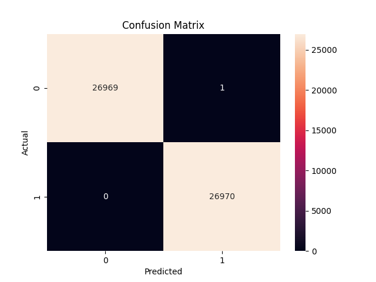
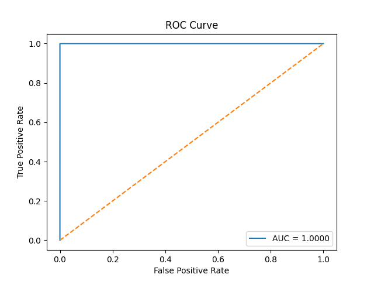

# SentryURL — Phishing Detection System

> **Real-time phishing URL detection powered by machine learning.**

[](https://www.sentryurl.dev/)

**🔗 Deployed site: [https://www.sentryurl.dev/](https://www.sentryurl.dev/)**

SentryURL is a full-stack, production-ready phishing detection system. Paste any URL and the system instantly classifies it as **safe** or **phishing** with a confidence score, backed by a LightGBM model trained on over 100,000 URLs and achieving **99.998 % test accuracy**.

---

## Table of Contents

- [Live Demo](#live-demo)
- [Screenshots](#screenshots)
- [Key Features](#key-features)
- [Tech Stack](#tech-stack)
- [Architecture](#architecture)
- [Getting Started](#getting-started)
  - [Prerequisites](#prerequisites)
  - [1 — AI / ML Service (FastAPI)](#1--ai--ml-service-fastapi)
  - [2 — Backend API (Laravel)](#2--backend-api-laravel)
  - [3 — Frontend (React)](#3--frontend-react)
- [Environment Variables](#environment-variables)
- [API Reference](#api-reference)
- [Testing & Linting](#testing--linting)
- [Deployment](#deployment)
- [Contributing](#contributing)
- [Security & Responsible Disclosure](#security--responsible-disclosure)
- [License](#license)

---

## Live Demo

| | |
|---|---|
| **Production URL** | [https://www.sentryurl.dev/](https://www.sentryurl.dev/) |
| **API Base URL** | `https://api.sentryurl.dev/api` |

---

## Screenshots

> **Hero — URL scan interface**


> **ML Model — Confusion Matrix**



> **ML Model — ROC Curve**



---

## Key Features

- **Instant URL scanning** — paste any URL and receive a phishing / safe verdict in milliseconds
- **Confidence gauge** — animated score shows how certain the model is (0 – 100 %)
- **60+ extracted features** — domain age, URL length, special characters, subdomain depth, digit ratios, and more
- **LightGBM model** — 99.998 % test accuracy on a balanced dataset of 53,940 URLs
- **Scan history** — paginated log of all previously scanned URLs, stored in a database
- **60-second response caching** — repeated scans for the same URL are served from cache, reducing ML calls
- **Dark / light theme** — toggleable glassmorphism UI
- **RESTful API** — fully decoupled backend suitable for integration with third-party tools

---

## Tech Stack

| Layer | Technology |
|---|---|
| **Frontend** | React 19, Vite 8, Axios, ESLint |
| **Backend** | Laravel 13 (PHP 8.3), Tailwind CSS, Predis |
| **AI / ML Service** | FastAPI 0.135, Uvicorn, LightGBM 4.6, scikit-learn, pandas, NumPy, joblib |
| **Database** | SQLite (default) |
| **Package managers** | npm, Composer, pip |

---

## Architecture

```
┌───────────────────────────────────────────────────────────┐
│              Frontend  (React + Vite)                      │
│  ScanForm ──► POST /api/scan-url                          │
│  ResultCard ◄── phishing / safe + confidence score        │
│  HistoryTable ◄── GET /api/history (paginated)            │
└────────────────────────┬──────────────────────────────────┘
                         │ HTTPS
┌────────────────────────▼──────────────────────────────────┐
│              Backend API  (Laravel 13 / PHP 8.3)           │
│  • Validates URL                                           │
│  • Checks 60-second cache                                 │
│  • Calls AI service → persists result to SQLite           │
│  Routes:  POST /scan-url · GET /history · GET /test       │
└────────────────────────┬──────────────────────────────────┘
                         │ HTTP  (AI_SERVICE_URL)
┌────────────────────────▼──────────────────────────────────┐
│              AI / ML Service  (FastAPI + Python)           │
│  • Extracts 60+ URL features                              │
│  • Runs LightGBM model (final_model.pkl)                  │
│  • Returns { result, confidence }                         │
│  Endpoints:  GET /  ·  POST /predict                      │
└───────────────────────────────────────────────────────────┘
```

---

## Getting Started

### Prerequisites

| Requirement | Minimum version |
|---|---|
| PHP | 8.3 |
| Composer | 2.x |
| Node.js | 18.x |
| npm | 9.x |
| Python | 3.10 |
| pip | 23.x |

---

### 1 — AI / ML Service (FastAPI)

```bash
cd ai_service

# Install dependencies
pip install -r requirement.txt

# Start the server on port 8001
uvicorn main:app --reload --host 0.0.0.0 --port 8001
```

Verify it is running:

```bash
curl http://127.0.0.1:8001/
# → "ML Service Running"
```

---

### 2 — Backend API (Laravel)

```bash
cd backend/api

# Install PHP and JS dependencies, copy .env, generate key, run migrations
composer run setup
```

> The `setup` script runs `composer install`, copies `.env.example` → `.env`, generates the application key, runs database migrations, installs npm packages, and builds front-end assets.

If you prefer to run steps manually:

```bash
composer install
cp .env.example .env
php artisan key:generate
php artisan migrate
npm install
npm run build
```

Start all backend services (Laravel server + queue worker + log watcher + Vite) with one command:

```bash
composer run dev
```

Or start only the API server:

```bash
php artisan serve --port=8000
```

---

### 3 — Frontend (React)

```bash
cd frontend

# Install dependencies
npm install

# Start the Vite dev server
npm run dev
```

The dev server starts at `http://localhost:5173` by default. The API base URL is configured in `frontend/src/api.js` — update `VITE_API_BASE_URL` if you are running the backend on a different host or port.

---

## Environment Variables

All variables live in `backend/api/.env` (copied from `.env.example`).

| Variable | Default | Description |
|---|---|---|
| `APP_NAME` | `Laravel` | Application name |
| `APP_ENV` | `local` | Environment (`local`, `production`) |
| `APP_KEY` | *(generated)* | 32-byte application encryption key |
| `APP_DEBUG` | `true` | Enable detailed error output |
| `APP_URL` | `http://localhost` | Backend base URL |
| `FRONTEND_URL` | `https://www.sentryurl.dev` | Allowed CORS origin |
| `DB_CONNECTION` | `sqlite` | Database driver |
| `AI_SERVICE_URL` | `http://127.0.0.1:8001` | URL of the FastAPI ML service |
| `CACHE_STORE` | `database` | Cache backend |
| `QUEUE_CONNECTION` | `database` | Queue backend |
| `LOG_CHANNEL` | `stack` | Log channel |
| `LOG_LEVEL` | `debug` | Minimum log level |
| `REDIS_HOST` | `127.0.0.1` | Redis host (optional, for production caching) |
| `REDIS_PORT` | `6379` | Redis port |

---

## API Reference

### Laravel Backend

| Method | Endpoint | Description |
|---|---|---|
| `POST` | `/api/scan-url` | Scan a URL for phishing |
| `GET` | `/api/history` | Retrieve paginated scan history |
| `GET` | `/api/test` | Health check |

#### `POST /api/scan-url`

**Request body**

```json
{
  "url": "https://example.com"
}
```

**Response**

```json
{
  "result": "safe",
  "confidence": 98.7
}
```

`result` is either `"safe"` or `"phishing"`. `confidence` is a percentage (0 – 100).

#### `GET /api/history`

Returns a list of all previously scanned URLs.

```json
[
  {
    "id": 1,
    "url": "https://example.com",
    "result": "safe",
    "confidence": 98.7,
    "created_at": "2024-01-15T10:30:00Z"
  }
]
```

---

### AI / ML Service (FastAPI)

| Method | Endpoint | Description |
|---|---|---|
| `GET` | `/` | Health check — returns `"ML Service Running"` |
| `POST` | `/predict` | Predict whether a URL is phishing |

#### `POST /predict`

**Request body**

```json
{
  "url": "https://suspicious-site.example.com/login"
}
```

**Response**

```json
{
  "result": "phishing",
  "confidence": 97.3
}
```

---

## Testing & Linting

### Backend (Laravel / PHP)

```bash
cd backend/api

# Run PHPUnit test suite
composer run test

# Or directly with artisan
php artisan test

# Code style lint (Laravel Pint)
./vendor/bin/pint --test
```

### Frontend (React)

```bash
cd frontend

# ESLint
npm run lint

# Production build (catches bundler errors)
npm run build
```

---

## Deployment

The application is live at **[https://www.sentryurl.dev/](https://www.sentryurl.dev/)**.

| Service | URL |
|---|---|
| Frontend | [https://www.sentryurl.dev/](https://www.sentryurl.dev/) |
| Backend API | `https://api.sentryurl.dev/api` |

**High-level deployment notes:**

- The **frontend** is a static Vite build served via a CDN / static host. Run `npm run build` and deploy the `frontend/dist/` folder.
- The **backend** is a standard Laravel application. Ensure you set `APP_ENV=production`, `APP_DEBUG=false`, and point `AI_SERVICE_URL` at the production ML service.
- The **AI service** is a Python/Uvicorn process. A process manager (e.g., systemd or Supervisor) is recommended to keep it running.

---

## Contributing

Contributions are welcome! Please follow these steps:

1. **Fork** the repository and create a new branch:
   ```bash
   git checkout -b feature/your-feature-name
   ```
2. **Make your changes** and ensure existing tests still pass (`composer run test` / `npm run lint`).
3. **Commit** with a clear, descriptive message.
4. **Open a pull request** targeting the `main` branch and describe what your change does and why.

Please keep pull requests focused — one feature or fix per PR makes review much easier.

---

## Security & Responsible Disclosure

SentryURL is a **detection tool**, not a blocking service. Please use it responsibly:

- **Do not** submit URLs to the API that you do not own or have permission to analyse.
- **Do not** rely solely on this tool to make security decisions — always use layered defences.
- The ML model may produce false positives or false negatives; treat results as one signal among many.

If you discover a security vulnerability in this project, please **do not** open a public GitHub issue. Instead, contact the maintainer directly so the issue can be addressed before public disclosure.

---

## License

No formal license has been specified for this repository. All rights are reserved by the author(s) unless otherwise stated. If you wish to use, modify, or distribute this code, please contact the repository owner to discuss licensing.

---

<p align="center">Built with ❤️ — <a href="https://www.sentryurl.dev/">sentryurl.dev</a></p>
